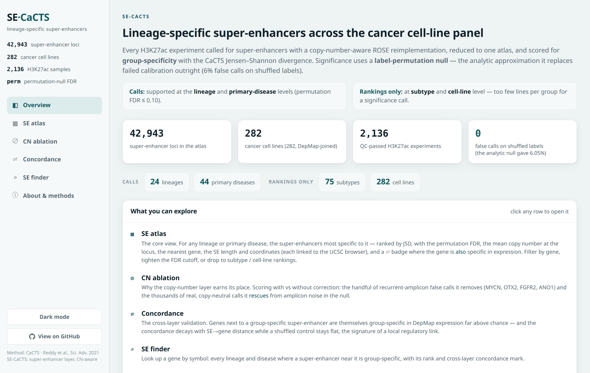
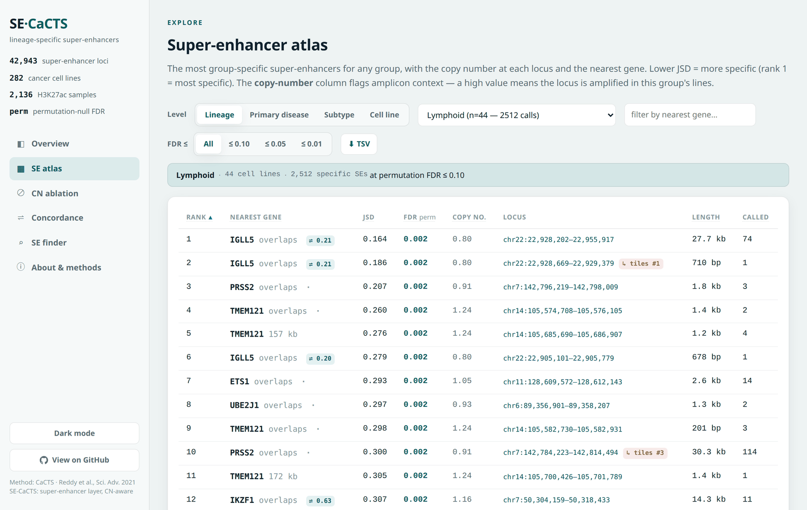
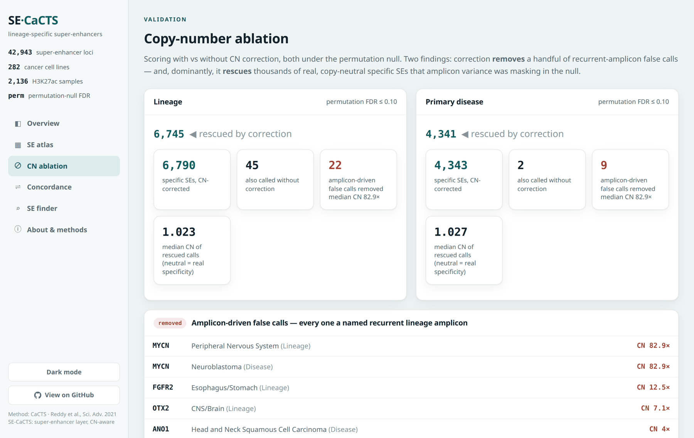
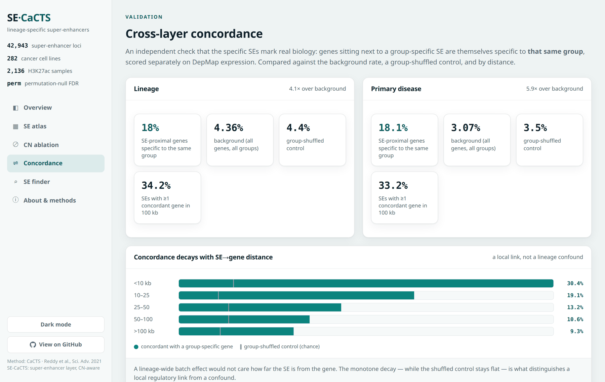

# SE-CaCTS: a copy-number-aware super-enhancer specificity score

### ▶ [**Explore the atlas: thirtysix.github.io/SE-CaCTS**](https://thirtysix.github.io/SE-CaCTS/)

Browse the lineage-specific super-enhancers for any of 24 cancer lineages and 44 primary diseases, with
copy number at each locus, the nearest gene, cross-layer concordance and a per-gene lookup. No install,
no backend.

[](https://thirtysix.github.io/SE-CaCTS/)

*A "CaCTS for super-enhancers": a per-super-enhancer, per-lineage specificity score computed from a large
H3K27ac ChIP-seq compendium, copy-number-corrected, to nominate lineage-defining super-enhancers, the
epigenomic analog of what CaCTS does for master transcription factors.*

| | | |
|---|---|---|
| **2,916** | H3K27ac experiments | pulled from ChIP-Atlas and called for super-enhancers |
| **43,931** | union super-enhancer loci | merged into one cross-sample catalogue |
| **282** | cancer cell lines | after QC, across **24** Oncotree lineages and **44** primary diseases |
| **6,790** | lineage-specific super-enhancers | in **23 of 24** lineages, at a calibrated permutation FDR ≤ 0.10 |
| **4,343** | disease-specific super-enhancers | in **41 of 44** primary diseases, same threshold |

The scored atlas is the QC-gated arm: **2,136** of those experiments, over **42,943** loci, collapsed to
the 282 cell lines above. Those are the numbers the dashboard shows, and every result below comes from
them. The wider 2,916 / 43,931 figures describe the raw pull and the full catalogue it produced.

---

## The idea in one paragraph

CaCTS (Reddy et al., *Sci Adv* 2021) scores each transcription factor by how *specifically* it is expressed in a
cancer lineage (Jensen-Shannon divergence of its cross-cancer expression vector against a one-hot "ideal"),
and uses that to nominate master TFs. Super-enhancers are the epigenomic markers of cell identity, yet no one
has built the analogous *per-super-enhancer* specificity score: "this super-enhancer is active specifically in
this cancer lineage versus all others." SE-CaCTS proposes to (1) build a reference H3K27ac atlas across a large
compendium of cancer cell lines, (2) **correct each line's signal for copy number** so amplicons (e.g. MYC) don't
masquerade as specificity, and (3) score each super-enhancer's lineage specificity with an individualized,
one-vs-rest statistic (the CaCTS JSD form) plus a **label-permutation FDR**. (The original plan reused the TF
layer's analytic empirical-null FDR; that null was later shown to fail calibration outright and was replaced;
see Status above.)

## Provenance: how this started

CaCTS scores **transcription factors** for lineage specificity from expression, and is used to nominate
master TFs. The natural question, "how would we do the CaCTS thing for the *super-enhancers* themselves?",
is this project. The CaCTS implementation it builds on lives in the sibling project **`pyCaCTS`**, which
scores the TF layer on the same JSD engine; SE-CaCTS is the enhancer layer of the same idea, and the
Concordance analysis is where the two layers meet.

**The calibration finding generalizes beyond this project.** The analytic empirical-null FDR that failed
here is the same one `pyCaCTS` used, and it fails there too, at 8.4% false calls on shuffled labels. Both
were rebuilt on a permutation null. A related consequence worth recording: **a single-sample (n = 1) FDR is
indefensible** under an honest null, because a one-member group cannot be distinguished from a random draw
of one.

---

## Analysis Steps

**Status (2026-07-28): the atlas is built, scored, validated, and browsable.** Phases 1, 2, 4, 5, 6 and 7
are done; **Phase 3 (copy-number inference) is the one open phase**, and it is really a *scope-expansion*
step rather than a blocker. See below.

| phase | what | state |
|---|---|---|
| Step A / B | novelty check; cross-study H3K27ac normalization pilot | done: novelty holds, batch is normalizable |
| 1 | metadata harmonization (ChIP-Atlas × Cellosaurus × DepMap) | done: 2,917 QC-pass experiments, 332 lines; **631-line investigable scope** |
| 2 | reference SE atlas: grid, pull, SE calling, reduce | **done, executed at scale on CSC Roihu** (~43 BU) |
| 4 | hierarchical CaCTS JSD specificity + permutation FDR | done at scale |
| 5 | copy-number ablation | done at scale |
| 6 | cross-layer concordance bridge (SE ↔ expression) | done, both stages |
| 7 | results dashboard | done, `docs/` (served by GitHub Pages) |
| **3** | **CN inference for lines without DepMap WGS** | **open**, only needed to grow past 324 lines |

**The atlas.** The full 2,917-sample pull ran on Roihu (2,916 done, one retired SRX, zero OOM) and the
barrier reduce built the reference atlas of **2,916 samples × 43,931 union super-enhancer loci**
(`max|err| = 0` on grid→SE reconstruction), plus the **canonical S3norm-normalized atlas**, 2,136
QC-passed samples × 42,943 loci, collapsing to **282 DepMap cell lines** across 24 Oncotree lineages /
44 primary diseases / 75 subtypes. The SE caller is `cnrose/`, a bigWig-native, copy-number-aware
reimplementation of ROSE validated **bit-for-bit against ROSE2** (SE Jaccard 1.0000).

**⚠️ The significance framework changed, and the earlier numbers were withdrawn.** The analytic
(normal-approximation) empirical-null FDR that this project, and the sibling TF pipeline, originally
used **fails an outright calibration test**: run on shuffled group labels, where nothing real exists to
find, it calls **6.05%** of tests "specific" (vs 7.4% on real data). It is a non-functional FDR, not a
loose one. The canonical run is now a **label-permutation null** (B = 1,000), which calls **0%** on
shuffled labels. Every count in this repo is the permutation one; the analytic counts are void.
See `RESULTS.md` for the calibration test and what it means for every count here.

**Read `RESULTS.md` for what is actually claimable.** It is deliberately narrower than the raw outputs.
This directory also holds the design, prior-art review, plan, pilot, and all phase work, so the project
can be picked up cold.

---

## Results at a glance (`RESULTS.md` is the authority)

- **Specificity calls are supported at lineage and primary-disease level only:** 6,790 calls across 23/24
  lineages and 4,343 across 41/44 diseases, at permutation FDR ≤ 0.10. **Subtype and cell-line level are
  rankings only**: 1 call across all 75 subtypes, because 29 of them contain a single cell line and the
  permutation preserves group size. This limitation should lead any write-up.
- **Known lineage biology is recovered with no supervision:** Ovary/Fallopian Tube → **MECOM** #1, #2, #8
  and **SOX17** #6; Bowel → **HNF4A** #4, **CDX2** #14; Myeloid → **SPI1** #9. Nothing supplied these
  genes to the scorer.
- **The negative controls are the convincing part:** six triple-negative breast lines bury ESR1 at ranks
  11,000–21,000, while lobular carcinoma (near-always ER+) gives ESR1 #22. The method was never told
  which lines were ER+.
- **Copy-number correction validates itself twice.** It removes a handful of false calls, and every one is
  a *named* recurrent amplicon found unprompted: MYCN in neuroblastoma (CN 83×), OTX2 in medulloblastoma,
  FGFR2 in gastric, ANO1/11q13 in head & neck. Its dominant effect at these resolutions, though, is
  **rescue**: correction takes lineage calls from 67 → 6,790, and the rescued calls are copy-neutral
  (`cn_mean` median 1.025). Even MECOM, SOX17, CDX2 and SPI1 only pass *with* correction.
- **An independent layer agrees.** Genes beside a group-specific SE are themselves specific to that same
  group in DepMap expression at **18.0%** vs a 4.36% background (**4.1×**) at lineage level, decaying
  monotonically with SE→gene distance while a group-shuffled control stays flat. This rate roughly
  **doubles** on the permutation-filtered set versus the analytic one, independent evidence that the
  permutation FDR removes noise rather than signal.

---

---

## Why it appears to be novel research (see `PRIOR_ART.md` for the evidence)

A deep literature search (2026-07-16) found the pieces exist separately but have **never been combined**:
- Per-SE specificity from H3K27ac across a compendium **is** precedented (Ryu et al. 2019 (tau, 30 normal
  tissues), SEA v4.0 (Shannon entropy), cSEAdb (prevalence, NCI-60 cancer)), but all use *general* metrics or
  presence/absence, none use the CaCTS JSD form, and **none correct for copy number**.
- Copy-number-aware SE work exists (Zhang et al. 2016, *Nat Genet*) but does the **inverse**: it uses the
  CN↔H3K27ac coupling to *find* amplified super-enhancers, rather than correcting it out to isolate specificity.
- CN normalization of ChIP/ATAC signal is a solved recipe (Su/Chen et al. 2025), just never joined to SE
  specificity.

So the novel contributions are **novel-in-combination** plus a genuinely **novel copy-number-aware dimension**,
with **breadth** (2,136 H3K27ac experiments over 282 cancer cell lines, as built) and **integration with the
master-TF / CRC layer** as additional differentiators.

## Data at a glance (see `DATA_SOURCES.md`)

- **ChIP-Atlas H3K27ac:** **2,916 cancer-cell-line experiments** pulled (of 2,917 in the manifest; one
  retired SRX). After the `--min-peaks 2000` QC gate the canonical atlas is **2,136 experiments on 282
  DepMap cell lines**. (The pre-Phase-1 scoping figure of "~1,789 experiments / ~295 cell types" was the
  vendor-advertised estimate and is superseded by these measured counts.)
- **DepMap** (joins by cell line): copy number (the correction input), expression (target-gene readout),
  CRISPR dependency (function).
- Optional corroborating marks/factors from ChIP-Atlas: H3K4me1/me3, H3K27me3, BRD4/MED1/EP300, lineage
  master-TF ChIP, ATAC/DNase.

## Browse the results

`docs/` is a static, no-backend results explorer (six tabs: Overview, SE atlas, CN ablation,
Concordance, SE finder, About & methods). It presents the **permutation basis only** and enforces the
resolution rule in the UI: calls at lineage/disease, rankings-only banners at subtype/cell line.

```bash
cd docs && python3 -m http.server 8000 --bind 127.0.0.1   # then open http://127.0.0.1:8000
```

The staged `data/` is committed, so this works straight from a clone with no setup.

| SE atlas | Copy-number ablation |
|---|---|
| [](https://thirtysix.github.io/SE-CaCTS/#atlas) | [](https://thirtysix.github.io/SE-CaCTS/#cn) |
| The most group-specific super-enhancers for a group, with permutation FDR, copy number, nearest gene, locus and how many experiments called each one. | What correction removes (named recurrent amplicons) versus what it rescues (real, copy-neutral specificity). |

[](https://thirtysix.github.io/SE-CaCTS/#concordance)

*Cross-layer validation: genes beside a group-specific super-enhancer are themselves specific to that same
group in DepMap expression, far above background, and the effect decays with distance while a shuffled
control stays flat.*

## Setup (only needed to *run* the pipeline)

No local path or HPC allocation is hardcoded anywhere in the tree; they live in a gitignored `.env`.

```bash
cp sample.env .env      # then edit: point SECACTS_DATAROOT at your reference datasets
python3 secacts_env.py  # prints the resolved config; verifies .env is found
```

`sample.env` documents every key and the directory layout expected under `SECACTS_DATAROOT`. SE-CaCTS
does not vendor those reference datasets (DepMap, ChIP-Atlas, Cellosaurus, an Ensembl GTF, and the
sibling `pyCaCTS` checkout); they are large and shared, see `DATA_SOURCES.md`. Any variable can also be
set in the environment for a one-off run, which wins over `.env`:

```bash
SECACTS_DATAROOT=/data/mirror python phase2/score_pilot.py ...
```

Regenerate the dashboard's `data/` after a rescoring run with `phase2/scripts/60_stage_dashboard.py`.

## Documents in this directory

- **`README.md`**. This file (front door, status, pitch).
- **`RESULTS.md`**. **The claims document: what the project can currently assert, at what resolution, and
  with what caveats.** Read this before quoting any number from the repo.
- **`ROADMAP.md`**. Phased plan, milestones, the two cheap de-risking steps, open questions.
- **`PRIOR_ART.md`**. The literature synthesis with citations, the landscape table, and the honest novelty verdict.
- **`DESIGN.md`**. The technical design and every decision made so far (approach landscape, the general-vs-
  individualized fork, statistic choice + defense, CN correction, additional-data model, the normalization risk).
- **`DATA_SOURCES.md`**. Data inventory and the assembly/harmonization plan.
- **`STEP_A_NOVELTY_CHECK.md`**. The Step-A result: full SEdb 3.0 (2026) check, closest-analog table, verdict, citations.
- **`pilot/`**. The Step-B normalization pilot: `PILOT.md` (design + GREEN result), `scripts/` (00–05 pipeline), `roihu/` (CSC Roihu run scaffold), `results/` (PCA figures).
- **`phase1/`**. Data assembly: `README.md`, `scripts/` (metadata fetch + Cellosaurus→DepMap join), `data/phase1_manifest.tsv` (the H3K27ac × DepMap manifest), `CELL_LINE_IDENTITY.md` (the 631-line investigable scope + the two join bugs fixed), `CN_COVERAGE.md` (per-line copy-number availability, the Phase-3 input).
- **`phase2/`**. Reference SE atlas + signal pull, **EXECUTED on Roihu**: `PULL_DESIGN.md` (the stream-to-Roihu design + live findings §8.6-8.7), `array.slurm`/`reduce.slurm` (the pull + barrier reduce), `scripts/` (`22_fetch_peaks.sh`, `40_pull_one.sh` the per-sample unit, `42_preflight.sh`, `43_run_stage.sh` staged rollout, `45_recompute_qc.py`, `51_compress_results.sh`, `52_coarsen_archives.py`, `60_stage_dashboard.py`), `aggregate.py` (union catalog + matrices, reads `.f32`), `s3norm.py`, `specificity.py` (global-BH FDR), `permutation.py` (the label-permutation null), `score_pilot.py` (hierarchical scoring), `analysis/` (CN ablation, concordance bridge, null calibration, SE drill-down), `tests/`, `data/` (grid + `pull_set.tsv`).
  - **`phase2/results/`**. The atlas artifacts. The small ones (presence matrices, union catalogs, S3norm parameters) are tracked in git; the two signal matrices exceed GitHub's 100 MB limit and live on Dropbox + an external SSD only. See `phase2/results/README.md`.
  - **`phase2/scores/`**. The scoring outputs. **`atlas.s3.perm.*` is canonical**; the unprefixed `atlas.s3.*` analytic outputs are retained for comparison only and their counts are void.
- **`cnrose/`**. The SE caller: `DESIGN.md` (build spec + all locked decisions), `cnrose/` (the `pyBigWig`+`numpy` package: io/stitch/callsuper/pipeline/cli + `cn/` provider layer), `tests/validate_vs_rose2.py` (the bit-for-bit ROSE2 validation). BigWig-native, external-CN, ROSE-style: the "CNV-aware ROSE" LILY only approximates.
- **`docs/`**. The static results dashboard, served by GitHub Pages (see "Browse the results" above).
- **`RUBBERDUCK.md`**. A jargon-free, evergreen explainer of the whole project for a non-specialist.

## To resume later

Read **`RESULTS.md`** first (what is claimable), then `ROADMAP.md` (what is left). For background: `PRIOR_ART.md` (what exists), `STEP_A_NOVELTY_CHECK.md`
(novelty confirmed), `DESIGN.md` (decisions), `cnrose/DESIGN.md` and `phase2/PULL_DESIGN.md` (the two
build specs), `RUBBERDUCK.md` (a jargon-free explainer of the whole project).

**The open work**, none of it blocking. **Phase 3**: copy-number inference for cell lines without DepMap
WGS. Note this is *scope expansion*, not a gap: the current atlas already covers all DepMap-WGS lines, so
CN inference only matters for growing from 324 toward the ~722-line ceiling (`phase1/CN_COVERAGE.md`).
Also open: a second copy of the 26 GB per-sample retention set (`out/`, currently single-copy on an
external SSD; CSC Allas is the earmarked home); regenerating the CN-corrected *calling-time* atlases from
the retained `.enhancers.tsv` (no re-pull needed); and scoring the un-gated agnostic atlas as robustness
insurance against the `--min-peaks 2000` QC gate.
