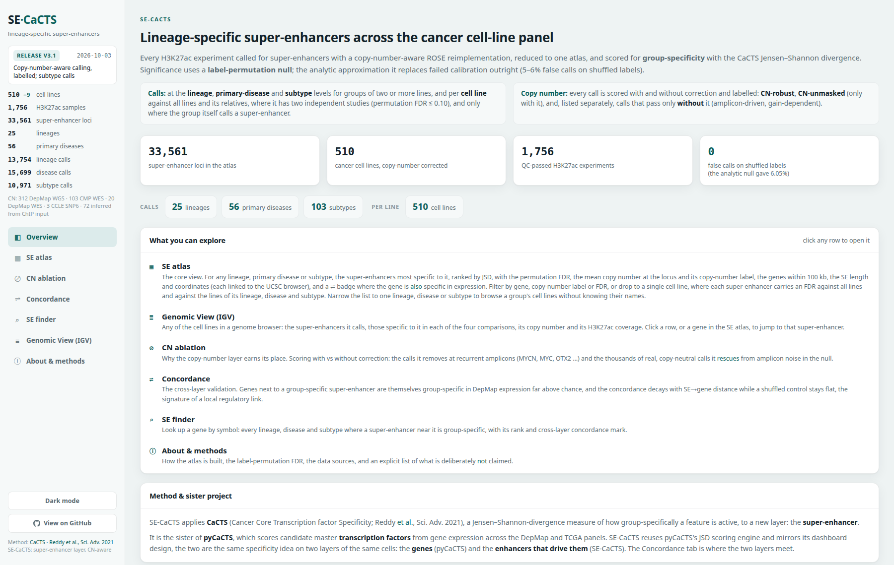
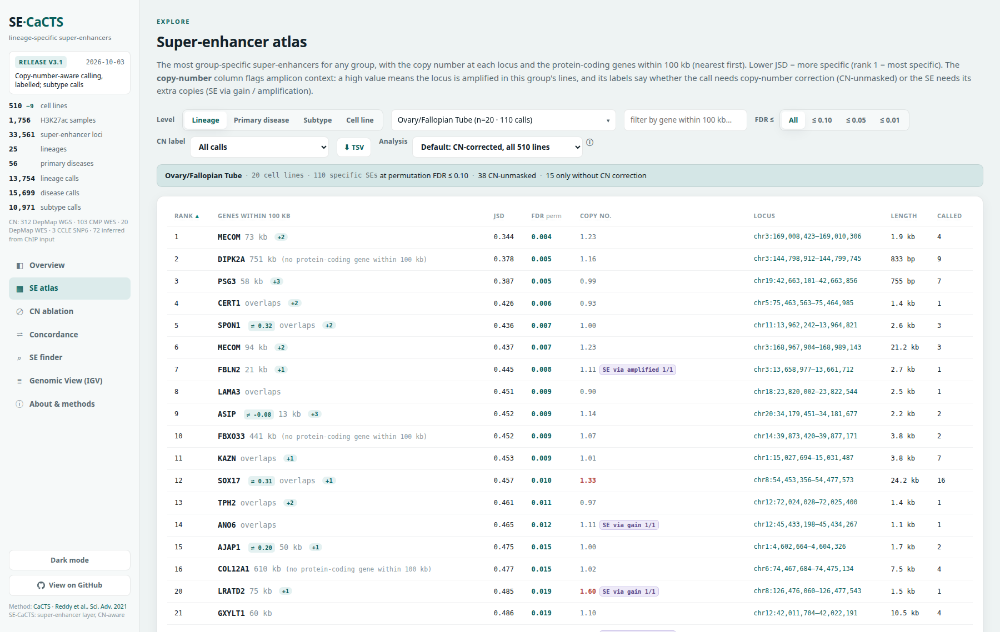
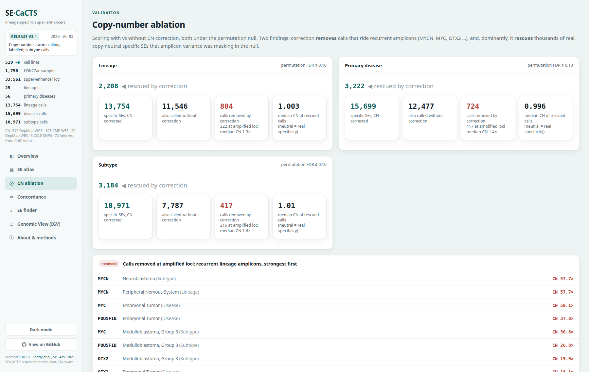
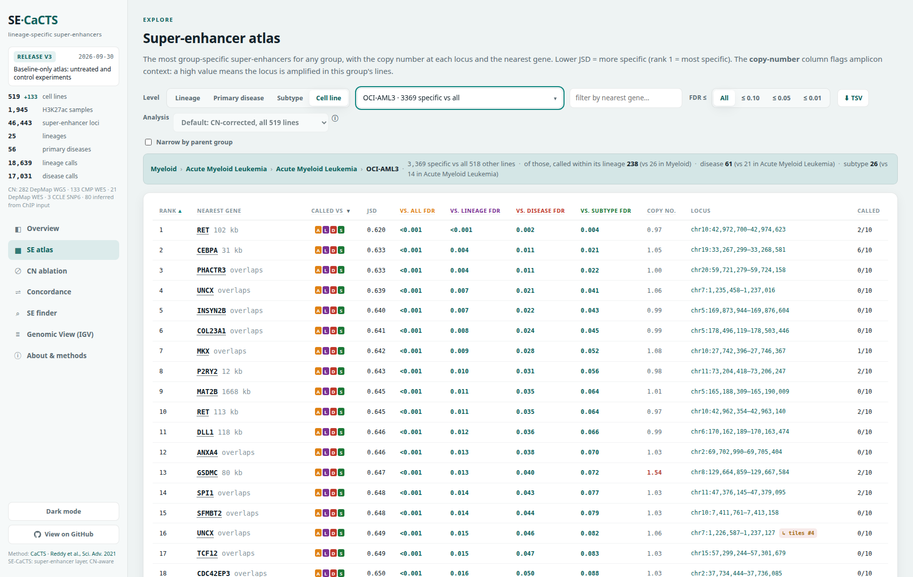
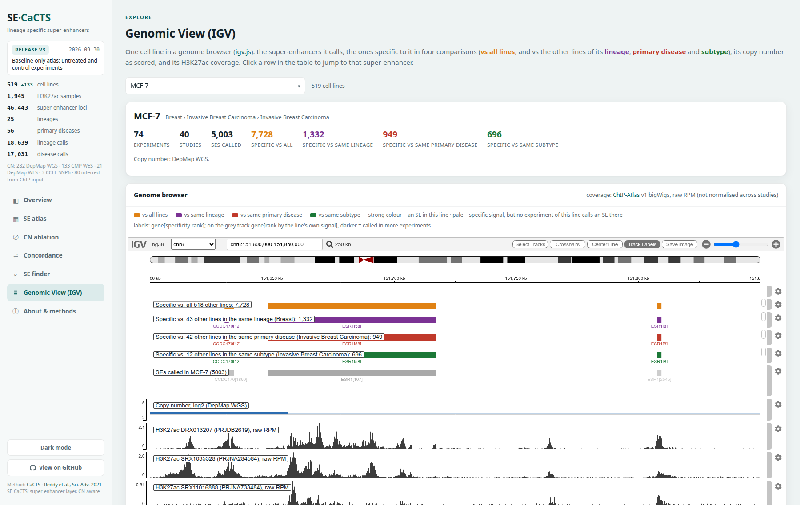
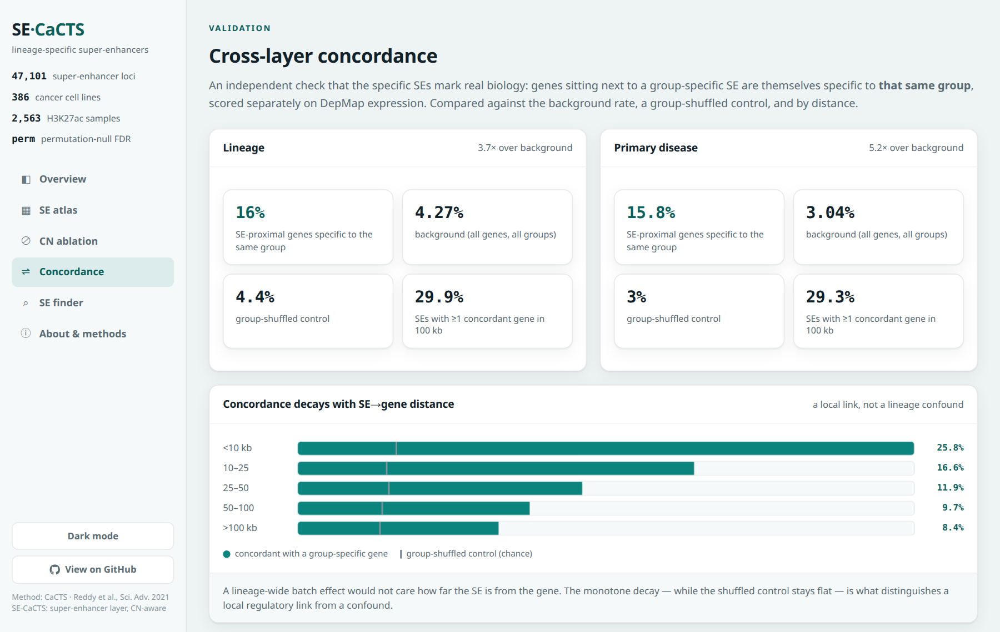

# SE-CaCTS: a copy-number-aware super-enhancer specificity score

### ▶ [**Explore the atlas: thirtysix.github.io/SE-CaCTS**](https://thirtysix.github.io/SE-CaCTS/)

Browse the lineage-specific super-enhancers for any of 25 cancer lineages and 56 primary diseases, and each
of 519 cell lines compared with all lines and with the lines of its subtype, disease and lineage, with copy
number at each locus, the nearest gene, cross-layer concordance, a per-gene lookup and a genome browser. No
install, no backend.

[](https://thirtysix.github.io/SE-CaCTS/)

*A "CaCTS for super-enhancers": a per-super-enhancer, per-lineage specificity score computed from a large
H3K27ac ChIP-seq compendium, copy-number-corrected, to nominate lineage-defining super-enhancers, the
epigenomic analog of what CaCTS does for master transcription factors.*

| | | |
|---|---|---|
| **2,422** | untreated or control H3K27ac experiments | from ChIP-Atlas, plus SRA data it lacks run through its own v1 pipeline |
| **46,443** | union super-enhancer loci | in the scored, QC-gated catalogue |
| **519** | cancer cell lines | after QC, each with copy number, across **25** Oncotree lineages and **56** primary diseases |
| **15,324** | lineage-specific super-enhancers | in **24 of 25** lineages, at a calibrated permutation FDR ≤ 0.10, each a super-enhancer in its own lineage |
| **13,950** | disease-specific super-enhancers | in **49 of 56** primary diseases, same rule |

The scored atlas is the QC-gated arm: **1,945** of those experiments, over **46,443** loci, collapsed to
the 519 cell lines above. Copy number comes from DepMap WGS for 282 lines, Cell Model Passports WES for 133,
DepMap WES for 21 and CCLE SNP6 for 3, and is inferred from ChIP input for 80 (a weaker correction; the
dashboard's Analysis selector shows the atlas without those lines). This is the **v3.0.1** atlas (2026-09-30):
**baseline only**, meaning drug-treated, knocked-down and otherwise perturbed experiments, input controls and
other marks were removed after every experiment's GEO record was read. The v2 atlas (386 lines, treated
experiments included) is kept in `phase2/results_v2/` and `phase2/scores_v2/`; 87.8% of its lineage calls
reappear in v3, and no quality measure degraded (calibration, expression concordance, master-regulator
recovery). **v3.0.1** adds a rule: a specific locus must also be a super-enhancer in its group, i.e. at least one
experiment of the lineage, disease or line calls a super-enhancer overlapping it
(`phase2/scripts/74_called_filter.py`). Scoring measures signal at every locus any experiment calls, so before
this 18% of lineage calls and 74% of per-line calls were loci where the group had the most H3K27ac but called no
super-enhancer. Master regulators found in their own lineage: 19 of 22 (HNF4A drops out).

---

## The idea in one paragraph

CaCTS (Reddy et al., *Sci Adv* 2021) scores each transcription factor by how *specifically* it is expressed in a
cancer lineage (Jensen-Shannon divergence of its cross-cancer expression vector against a one-hot "ideal"),
and uses that to nominate master TFs. Super-enhancers are the epigenomic markers of cell identity, yet no one
has built the analogous *per-super-enhancer* specificity score: "this super-enhancer is active specifically in
this cancer lineage versus all others." SE-CaCTS proposes to (1) build a reference H3K27ac atlas across a large
compendium of cancer cell lines, (2) **correct each line's signal for copy number** so amplicons (e.g. MYC) don't
masquerade as specificity, and (3) score each super-enhancer's lineage specificity with an individualized,
one-vs-rest statistic (the CaCTS JSD form) plus a **label-permutation FDR**. (The original plan reused the TF
layer's analytic empirical-null FDR; that null was later shown to fail calibration outright and was replaced;
see Status above.)

## Provenance: how this started

CaCTS scores **transcription factors** for lineage specificity from expression, and is used to nominate
master TFs. The natural question, "how would we do the CaCTS thing for the *super-enhancers* themselves?",
is this project. The CaCTS implementation it builds on lives in the sibling project **`pyCaCTS`**, which
scores the TF layer on the same JSD engine; SE-CaCTS is the enhancer layer of the same idea, and the
Concordance analysis is where the two layers meet.

**The calibration finding generalizes beyond this project.** The analytic empirical-null FDR that failed
here is the same one `pyCaCTS` used, and it fails there too, at 8.4% false calls on shuffled labels. Both
were rebuilt on a permutation null. A related consequence worth recording: **a single-sample (n = 1) FDR is
indefensible** under an honest null, because a one-member group cannot be distinguished from a random draw
of one.

---

## Analysis Steps

**Status (2026-09-30): the v3 atlas is built, scored, validated, and browsable.** Phases 1 to 7 are done,
including copy-number inference from ChIP input for lines no measured source covers. The v3.1 plan (label
fixes, a stricter copy-number floor, subtype-level testing) is in `ROADMAP.md`.

| phase | what | state |
|---|---|---|
| Step A / B | novelty check; cross-study H3K27ac normalization pilot | done: novelty holds, batch is normalizable |
| 1 | metadata harmonization (ChIP-Atlas × Cellosaurus × DepMap) | done: 2,917 QC-pass experiments, 332 lines; **631-line investigable scope** |
| 2 | reference SE atlas: grid, pull, SE calling, reduce | **done, executed at scale on CSC Roihu** (~43 BU) |
| 4 | hierarchical CaCTS JSD specificity + permutation FDR | done at scale |
| 5 | copy-number ablation | done at scale |
| 6 | cross-layer concordance bridge (SE ↔ expression) | done, both stages |
| 7 | results dashboard | done, `docs/` (served by GitHub Pages) |
| 3b | CN-source expansion: CMP WES + DepMap WES → **v2 atlas, 386 lines** | done 2026-09-28 (~10 BU) |
| 3 | CN *inference* from ChIP input, for lines no measured source covers | done: used for 80 lines that pass a quality gate; corrects less than measured copy number |
| v3 | baseline-only atlas: every experiment's GEO record read, perturbed experiments removed; own processing of SRA data ChIP-Atlas lacks | done 2026-09-30 (519 lines) |

**The atlas.** Two pulls ran on Roihu with the same code: 2,916 experiments for the v1 panel (one retired
SRX) and 552 more for the 122 lines that became copy-number-correctable through whole-exome sources. The
barrier reduce built **3,468 samples × 48,180 union super-enhancer loci** (`max|err| = 0` on grid→SE
reconstruction) and the **canonical S3norm-normalized atlas**, 2,563 QC-passed samples × 47,101 loci,
collapsing to **386 cell lines** across 24 Oncotree lineages / 46 primary diseases / 84 subtypes. v1's
samples normalize bit-identically in v2 (the S3norm reference is pinned). The SE caller is `cnrose/`, a
bigWig-native, copy-number-aware reimplementation of ROSE validated **bit-for-bit against ROSE2** (SE
Jaccard 1.0000).

**⚠️ The significance framework changed, and the earlier numbers were withdrawn.** The analytic
(normal-approximation) empirical-null FDR that this project, and the sibling TF pipeline, originally
used **fails an outright calibration test**: run on shuffled group labels, where nothing real exists to
find, it calls **5.2%** of tests "specific" (vs 7.4% on real data; 6.05% vs 7.4% on v1). It is a
non-functional FDR, not a loose one. The canonical run is now a **label-permutation null** (B = 1,000),
which makes **0 calls** on shuffled labels across 8.5 million tests at three levels in v3 (7.25 million in
v2). Every count in this repo is the permutation one; the analytic counts are void.
See `RESULTS.md` for the calibration test and what it means for every count here.

**Read `RESULTS.md` for what is actually claimable.** It is deliberately narrower than the raw outputs.
This directory also holds the design, prior-art review, plan, pilot, and all phase work, so the project
can be picked up cold.

---

## Results at a glance (`RESULTS.md` is the authority)

- **Specificity calls are supported at lineage and primary-disease level only:** 12,994 calls across 23/24
  lineages and 11,652 across 43/46 diseases, at permutation FDR ≤ 0.10. **Subtype and cell-line level are
  rankings only**: 10 calls across 84 subtypes, because 27 of them contain a single cell line and 62 hold
  four or fewer. A 37% larger panel did not change this; it needs more lines per subtype.
- **Known lineage biology is recovered with no supervision:** of 22 master regulators chosen from the
  literature beforehand, the best nearby SE passes in its own lineage for **18 (82%)** against 4.5% in the
  other lineages. Ovary/Fallopian Tube → **MECOM** #1, **SOX17** #5; Bowel → **HNF4A** #6; Myeloid →
  **SPI1** #7; Peripheral nervous system → **PHOX2B** #3. Nothing supplied these genes to the scorer.
- **The negative controls are the convincing part** (v1 panel): six triple-negative breast lines bury ESR1
  at ranks 11,000–21,000, while lobular carcinoma (near-always ER+) gives ESR1 #22. The method was never
  told which lines were ER+.
- **Copy-number correction validates itself twice.** At lineage and disease level it removes 1,498 calls,
  61% of them at amplified loci and led by recurrent amplicons found unprompted: MYCN in neuroblastoma (CN 47×,
  with co-amplified DDX1), MYC and POU5F1B at 8q24, OTX2. It also **rescues** 6,935 copy-neutral calls (median
  CN 1.01) that amplicon spikes were hiding in the permutation null: +12% at lineage level, +37% at disease
  level. (v1's "67 → 6,790" at lineage level was a BH threshold effect; see `RESULTS.md`.)
- **An independent layer agrees.** Genes beside a group-specific SE are themselves specific to that same
  group in DepMap expression at **15.3%** vs a 4.12% background (**3.7×**) at lineage level (5.1× at
  disease level), decaying monotonically with SE→gene distance while a group-shuffled control stays flat.
  On v1 this rate roughly **doubled** on the permutation-filtered set versus the analytic one, independent
  evidence that the permutation FDR removes noise rather than signal.
- **Robust to the lines, less so to the copy-number source.** Dropping 8 lines whose copy number disagrees
  between sources keeps 96–98% of calls; correcting 228 lines with exome instead of genome copy number
  keeps 85–89%. Exome copy number captures less of the signal's copy-number dependence in the same lines,
  so CN source is the main remaining sensitivity.

---

---

## Why it appears to be novel research (see `PRIOR_ART.md` for the evidence)

A deep literature search (2026-07-16) found the pieces exist separately but have **never been combined**:
- Per-SE specificity from H3K27ac across a compendium **is** precedented (Ryu et al. 2019 (tau, 30 normal
  tissues), SEA v4.0 (Shannon entropy), cSEAdb (prevalence, NCI-60 cancer)), but all use *general* metrics or
  presence/absence, none use the CaCTS JSD form, and **none correct for copy number**.
- Copy-number-aware SE work exists but not for specificity: LILY (Boeva et al. 2017, *Nat Genet*) corrects
  copy number at SE *calling* and computes no cross-sample specificity; Zhang et al. 2016 (*Nat Genet*) does
  the **inverse**, using the CN↔H3K27ac coupling to *find* amplified super-enhancers.
- CN normalization of ChIP/ATAC signal is a solved recipe (Su/Chen et al. 2025), just never joined to SE
  specificity.

So the novel contributions are **novel-in-combination** plus a genuinely **novel copy-number-aware dimension**,
with **breadth** (2,563 H3K27ac experiments over 386 cancer cell lines, as built) and **integration with the
master-TF / CRC layer** as additional differentiators.

## Data at a glance (see `DATA_SOURCES.md`)

- **ChIP-Atlas H3K27ac:** **3,468 cancer-cell-line experiments** pulled (v1 2,916 + v2 552; one retired
  SRX). After the `--min-peaks 2000` QC gate the canonical atlas is **2,563 experiments on 386 cell
  lines**. (The pre-Phase-1 scoping figure of "~1,789 experiments / ~295 cell types" was the
  vendor-advertised estimate and is superseded by these measured counts.)
- **Copy number** (the correction input): DepMap WGS, then Cell Model Passports WES pureCN (2025), then
  DepMap WES, in that order of preference; `phase1/CN_COVERAGE.md`.
- **DepMap** (joins by cell line): Oncotree labels, expression (target-gene readout), CRISPR dependency
  (function).
- Optional corroborating marks/factors from ChIP-Atlas: H3K4me1/me3, H3K27me3, BRD4/MED1/EP300, lineage
  master-TF ChIP, ATAC/DNase.

## Browse the results

`docs/` is a static, no-backend results explorer (six tabs: Overview, SE atlas, CN ablation,
Concordance, SE finder, About & methods). It presents the **permutation basis only** and enforces the
resolution rule in the UI: calls at lineage/disease, rankings-only banners at subtype/cell line.

```bash
cd docs && python3 -m http.server 8000 --bind 127.0.0.1   # then open http://127.0.0.1:8000
```

The staged `data/` is committed, so this works straight from a clone with no setup.

| SE atlas | Copy-number ablation |
|---|---|
| [](https://thirtysix.github.io/SE-CaCTS/#atlas) | [](https://thirtysix.github.io/SE-CaCTS/#cn) |
| The most group-specific super-enhancers for a group, with permutation FDR, copy number, nearest gene, locus and how many experiments called each one. | What correction removes (named recurrent amplicons) versus what it rescues (real, copy-neutral specificity). |

| One cell line, four comparisons | Genomic View (IGV) |
|---|---|
| [](https://thirtysix.github.io/SE-CaCTS/#atlas) | [](https://thirtysix.github.io/SE-CaCTS/#line) |
| Each line's specific super-enhancers against all lines and against the other lines of its subtype, disease and lineage; a badge shows which comparisons call each one. | Any of the 519 lines in igv.js: its super-enhancers, the four comparisons as tracks, copy number, and ChIP-Atlas coverage streamed per experiment. |

[](https://thirtysix.github.io/SE-CaCTS/#concordance)

*Cross-layer validation: genes beside a group-specific super-enhancer are themselves specific to that same
group in DepMap expression, far above background, and the effect decays with distance while a shuffled
control stays flat.*

## Setup (only needed to *run* the pipeline)

No local path or HPC allocation is hardcoded anywhere in the tree; they live in a gitignored `.env`.

```bash
cp sample.env .env      # then edit: point SECACTS_DATAROOT at your reference datasets
python3 secacts_env.py  # prints the resolved config; verifies .env is found
```

`sample.env` documents every key and the directory layout expected under `SECACTS_DATAROOT`. SE-CaCTS
does not vendor those reference datasets (DepMap, ChIP-Atlas, Cellosaurus, an Ensembl GTF, and the
sibling `pyCaCTS` checkout); they are large and shared, see `DATA_SOURCES.md`. Any variable can also be
set in the environment for a one-off run, which wins over `.env`:

```bash
SECACTS_DATAROOT=/data/mirror python phase2/score_pilot.py ...
```

Regenerate the dashboard's `data/` after a rescoring run with `phase2/scripts/60_stage_dashboard.py`,
labelling it with `--release vN --release-date YYYY-MM-DD --release-title "..."`. The sidebar shows the
current release; `docs/data/releases.json` keeps every release, and the About tab lists them.

## Documents in this directory

- **`README.md`**. This file (front door, status, pitch).
- **`RESULTS.md`**. **The claims document: what the project can currently assert, at what resolution, and
  with what caveats.** Read this before quoting any number from the repo.
- **`ROADMAP.md`**. Phased plan, milestones, the two cheap de-risking steps, open questions.
- **`PRIOR_ART.md`**. The literature synthesis with citations, the landscape table, and the honest novelty verdict.
- **`DESIGN.md`**. The technical design and every decision made so far (approach landscape, the general-vs-
  individualized fork, statistic choice + defense, CN correction, additional-data model, the normalization risk).
- **`DATA_SOURCES.md`**. Data inventory and the assembly/harmonization plan.
- **`STEP_A_NOVELTY_CHECK.md`**. The Step-A result: full SEdb 3.0 (2026) check, closest-analog table, verdict, citations.
- **`pilot/`**. The Step-B normalization pilot: `PILOT.md` (design + GREEN result), `scripts/` (00–05 pipeline), `roihu/` (CSC Roihu run scaffold), `results/` (PCA figures).
- **`phase1/`**. Data assembly: `README.md`, `scripts/` (metadata fetch + Cellosaurus→DepMap join), `data/phase1_manifest.tsv` (the H3K27ac × DepMap manifest), `CELL_LINE_IDENTITY.md` (the 631-line investigable scope + the two join bugs fixed), `CN_COVERAGE.md` (per-line copy-number availability, the Phase-3 input).
- **`phase2/`**. Reference SE atlas + signal pull, **EXECUTED on Roihu**: `PULL_DESIGN.md` (the stream-to-Roihu design + live findings §8.6-8.7), `array.slurm`/`reduce.slurm` (the pull + barrier reduce), `scripts/` (`22_fetch_peaks.sh`, `40_pull_one.sh` the per-sample unit, `42_preflight.sh`, `43_run_stage.sh` staged rollout, `45_recompute_qc.py`, `51_compress_results.sh`, `52_coarsen_archives.py`, `60_stage_dashboard.py`), `aggregate.py` (union catalog + matrices, reads `.f32`), `s3norm.py`, `specificity.py` (global-BH FDR), `permutation.py` (the label-permutation null), `score_pilot.py` (hierarchical scoring), `analysis/` (CN ablation, concordance bridge, null calibration, SE drill-down), `tests/`, `data/` (grid + `pull_set.tsv`).
  - **`phase2/results/`**. The atlas artifacts. The small ones (presence matrices, union catalogs, S3norm parameters) are tracked in git; the two signal matrices exceed GitHub's 100 MB limit and live on Dropbox + an external SSD only. See `phase2/results/README.md`.
  - **`phase2/scores/`**. The v1 scoring outputs. **`atlas.s3.perm.*` is canonical**; the unprefixed `atlas.s3.*` analytic outputs are retained for comparison only and their counts are void.
  - **`phase2/results_v2/`, `phase2/scores_v2/`**. The v2 atlas and its scoring (the current canonical basis), with the calibration (`*.shuffle.*`), ablation (`*.nocn.*`) and sensitivity (`*.nodisc.*`, `*.cmpfirst.*`) arms and the v1/v2 comparison (`compare_v1_v2.*`). See `phase2/results_v2/README.md`.
- **`cnrose/`**. The SE caller: `DESIGN.md` (build spec + all locked decisions), `cnrose/` (the `pyBigWig`+`numpy` package: io/stitch/callsuper/pipeline/cli + `cn/` provider layer), `tests/validate_vs_rose2.py` (the bit-for-bit ROSE2 validation). BigWig-native, external-CN, ROSE-style: the "CNV-aware ROSE" LILY only approximates.
- **`docs/`**. The static results dashboard, served by GitHub Pages (see "Browse the results" above).
- **`RUBBERDUCK.md`**. A jargon-free, evergreen explainer of the whole project for a non-specialist.

## To resume later

Read **`RESULTS.md`** first (what is claimable), then `ROADMAP.md` (what is left). For background: `PRIOR_ART.md` (what exists), `STEP_A_NOVELTY_CHECK.md`
(novelty confirmed), `DESIGN.md` (decisions), `cnrose/DESIGN.md` and `phase2/PULL_DESIGN.md` (the two
build specs), `RUBBERDUCK.md` (a jargon-free explainer of the whole project).

**The open work**, none of it blocking. **Phase 3**: copy-number inference from ChIP input for the ~180
lines no measured source covers. It is *scope expansion*, not a gap, and per-line agreement with measured
copy number (r 0.15–0.96) is still too variable to use (`phase1/CN_COVERAGE.md`).
Also open: a second copy of the 26 GB per-sample retention set (`out/`, currently single-copy on an
external SSD; CSC Allas is the earmarked home); regenerating the CN-corrected *calling-time* atlases from
the retained `.enhancers.tsv` (no re-pull needed); and scoring the un-gated agnostic atlas as robustness
insurance against the `--min-peaks 2000` QC gate.
